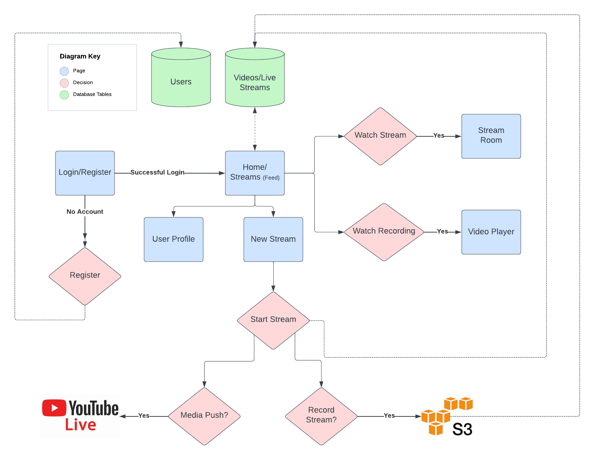

# Interactive Live Streaming Reference App

Truly interactive live streaming for gaming, live events and more. 

> Note: Show image for these 4 core features with a short description

1. Stream Events 
2. Message & Voice chat with Audiance
3. Broadcast streams on youtube
4. Record Events

## Summary

Think Twitch, Club House and Streamyards, all in one application. This is a place where users can schedule and host events with a live audiance via chat, along with the ability to bring up audiance memebers to speak via voice chat, just like you would on a twitter spaces or club house call. 

Streams can also be recorded and or boradcasted to 3rd party platforms like youtube. 

## Purpose & Target Audiance

This reference app targets the **`social`** and **`gaming`** vertical and provides a starting point for anyone looking for to add interactive live streaming features. This application will give a foundation for anyone looking to build something simular or features from the following virtual events organizations:

- `Twitch` - Interactive Live Streaming
- `Twitter` spaces/clubhouse - Voice chat
- `Stream Yards` - 3rd party broadcasting

## Tech Stack
- Backend: Django (Python)
- Frontend: React
- Database: Postgres (SQLite for demo)
- Hosting: Railway (Backend)/ Vercel (Frontend)
- Agora RTM, RTC

## Structure Diagram

## Functional Requirements

1. Video Stream
   1. Join & Leave Call
   2. Toggle Mic & Video (on/off)
   3. Screen Share
2. Voice Call 
   1. Join & Leave Call
   2. Toggle Mic (on/off)
   3. Display user name & avatar
   4. Admin controls over guests
3. Live Chat
   1. Send & Recieve Messages
4. Cloud Recording
   1. Record Streams
   2. Store streams
   3. Access Previous Streams
5. Broadcast to youtube
   1. Push Stream to 3rd party platforms

## Feature Specification

1. **Video Stream**
   1. Feature - Join & Leave Call
      1. Details - Join channel, publish & unpuiblish streams
      2. Agora Tools - RTC & Token Server
   2. Feature - Toggle Mic & Video
      1. Details - Host can mute mic & camera. H
      2. Agora Tools - RTC
   3. Feature: Screen Share
      1. Details: Host can share screen(s) & toggle bewtween video & screen at any point
      2. Agora Tools: RTC

2. **Voice Call**
   1. Feature - Join & Leave Call
      1. Details - Join channel, publish & unpuiblish streams (voice)
      2. Agora Tools - RTC & RTM
   2. Feature - Toggle Mic
      1. Details - Host & Participants can mute mic. Host can toglge guests controls.
      2. Agora Tools - RTC & RTM
   3. Feature: Display user name & avatar
      1. Details: Usernames & avatar display on remote guest screens
      2. Agora Tools: RTM
   4. Admin controls over guests
      1. Details: Host has full control over guests mic & can invite or kick guests when they need.
      2. Agora Tools: RTM
3. **Live Chat**
   1. Feature: Send & Recieve Messages
      1. Details: Real time chat during stream with host and guests
      2. Agora Tools: RTM
4. **Cloud Recording**
   1. Feature: Record Streams
      1. Details: Toggle stream recoring at any time
      2. Agora Tools: Cloud Recording, RTC, RESTful API
   2. Feature: Store streams 
      1. Details: Streams will be uploaded into an AWS S3 Bucket
      2. Agora Tools: RESTful API
   3. Feature: Access Previous Streams
      1. Details: Pulling streams form S3 Bucket for later viewership
      2. Agora Tools:: N/A
5. **Broadcast to youtube**
   1. Feature: Push Streams Live to youtube
      1. Details: Streams can be boradcasted on multiple platforms, live.
      2. Agoora Tools: Media Push, RTC